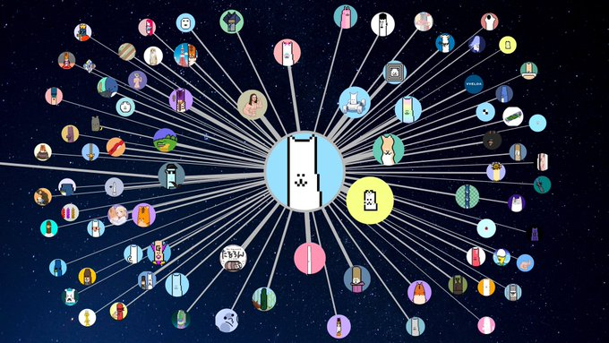

ReadMeファイルに含む6つの項目

プロジェクト名；sagita

プロジェクトについて；
NFTコレクション同士の依存関係（オリジナル作品と二次創作と関係性）の情報をブロックチェーン上に蓄積し、その情報を視覚的にわかりやすく表示するサービス。
MVPとしては
・親と子の関係をコントラクト上に追加する機能
・その関係についてステークホルダーがapprove機能
・それをビジュアライズして表示し探索できる機能（このようなグラフ形式でコミュニティを可視化し、探索できるようにする）
を予定している。

解決しようとしている課題；
NFTコレクションにおいて、二次創作とオリジナル作品が相互にコミュニティを盛り上げている一方で、このような関係性はコミュニティが成熟するほど複雑になり、新規参入者にとって理解しにくくなる、そこで二次創作とオリジナル作品の関係性をビジュアライズすることで新規参入のハードルを下げ、二次創作によるネットワーク効果を高める。

使用した技術；
contract address: 0xbc9482466Ab7a2842311Ae3E4832dBaB62F4b20F（mumbai testnet）

直面した課題；
・１つのNFTコレクションに対して１つのコントラクトアドレスがあるという仮定で設計を進めていたが、思いのほかOpenSeaの共有コントラクトを使用している二次創作コレクションが多く、特定のコレクションを持っているかどうかの判定に苦労している
・

NEXT
・フロントでの親子関係追加機能の実装
・フロントでのビジュアライズ機能の実装
・UIの最適化
